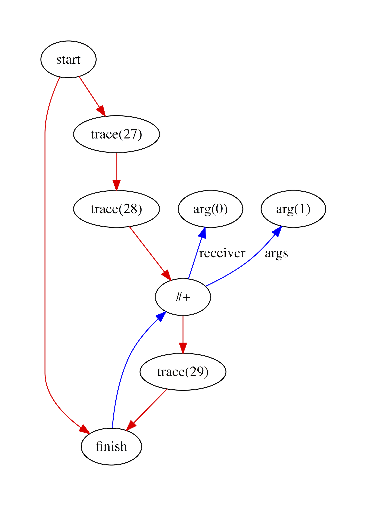

# RhizomeRuby

## Graph visualisation

Compilers often work with simple trees - you've probably heard of abstract
syntax trees - or they try to keep data structures as linear as possible, which
is one property of the basic blocks in traditional bytecode and two- or
three-address format intermediate representations. One advantage of this is that
trees and linear data structures can be relatively easily pretty-printed as text
for understanding and debugging the compiler. Rhizome uses a graphical
intermediate representation, which is not as easy to print out as text. The
sea-of-nodes approach that Rhizome uses means we have particularly complex
graphs. Rhizome therefore includes a tool to write out compiler graphs in a
format for the [Graphviz graph visualisation program](http://www.graphviz.org).

### Why we need it

Rhizome's intermediate representation is a graph which is hard to print out as
text in order to understand what the compiler is doing. In order to visualise
Rhizome's graphs, Rhizome includes a tool to write the graph in a format which
you can use with the Graphviz graph visualisation program.

Each node (oval) in the graph is a computation. Each edge (line) in the graph
is something passing from one node to another. Red edges are control flow.
A red arrow from one node to another means the first node must run before the
second. Blue edges are data flow. A blue arrow from one node to another means
the second node does some computation on the data from the first.

This example shows a graph for a simple add function in Ruby.

```ruby
def add(a, b)
  a + b
end
```



What all the nodes do and they are connected like this is explained in the
documents on our intermediate representation (IR) and how we build graphs.

Not demonstrated here are orange edges, which show edges that have connected
graph fragments (described later on), edges which will connect graph fragments
but are currently dangling, which are shown in dashed orange, and edges which
connect phi nodes to their merges, which are shown in dashed blue.

### How it works

Making graphs that look nice automatically is a challenging computer science
problem! Therefore we delegate the work of doing that to a program called
Graphviz. You give Graphviz a text description of a graph and it can produce a
high quality PDF for you, choosing where to place all the nodes, how to shape
the edges, and so on.

All we have to do therefore is iterate over the nodes and edges in our graphs,
or graph fragments, and print them out to text, before running the Graphviz
program. The text we print for the graph above looks like this:

```
digraph {
  node70172598584460[label="start"];
  node70172598584460 -> node70172598584340[color="red"];
  node70172598584460 -> node70172598585720[color="red"];
  node70172598585720[label="merge"];
  node70172598585720 -> node70172598585220[color="red"];
  node70172598585220[label="trace(27)"];
  node70172598585220 -> node70172598585060[color="red"];
  node70172598585060[label="trace(28)"];
  node70172598585060 -> node70172598584860[color="red"];
  node70172598584860[label="#+"];
  node70172598584860 -> node70172598584660[color="red"];
  node70172598584860 -> node70172598584340[color="blue", dir="back"];
  node70172598584340[label="finish"];
  node70172598584660[label="trace(29)"];
  node70172598584660 -> node70172598584340[color="red"];
  node70172598585540[label="arg(0)"];
  node70172598585540 -> node70172598584860[color="blue", label="receiver", dir="back"];
  node70172598585380[label="arg(1)"];
  node70172598585380 -> node70172598584860[color="blue", label="arg(0)", dir="back"];
}
```

You can probably appreciate from this why we use a visual tool. Looking at the
text equivalent it's very hard to understand the structure of the graph.

### More technical details

I'm not sure exactly what algorithm the Graphviz dot layout program uses, but
they have [documented it](https://link.springer.com/content/pdf/10.1007%2F3-540-45848-4_19.pdf).
It's extremely impressive that they can make structure from a raw description of
the graph.

The JVM ecosystem has the [Ideal Graph Visualizer](igv), a graphical user
interface desktop application for achieving the same goal. Ideal is the name of
the intermediate representation used by the server compiler (also called 'C2',
the one you get with the `-server` flag) in the HotSpot JVM, but it can now be
used with other graphical compilers such as Graal.

[igv]: https://ssw.jku.at/Research/Papers/Wuerthinger07Master/Wuerthinger07Master.pdf

The Turbofan tier of the V8 just-in-time compiler for JavaScript has a
visualiser called
[Turbolizer](https://groups.google.com/forum/#!topic/v8-dev/RtB5s6WI6ik).

### Potential projects

* Output graphs to the IGV API so that a graphical user interface can be used
  to navigate and re-arrange the graph.
* Write an HMTL 5 interactive visualiser and have Rhizome expose a web server
  to access it.
