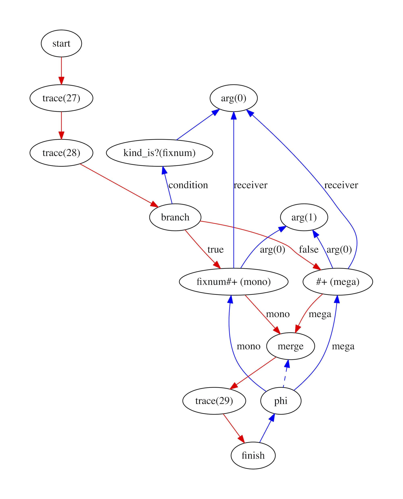
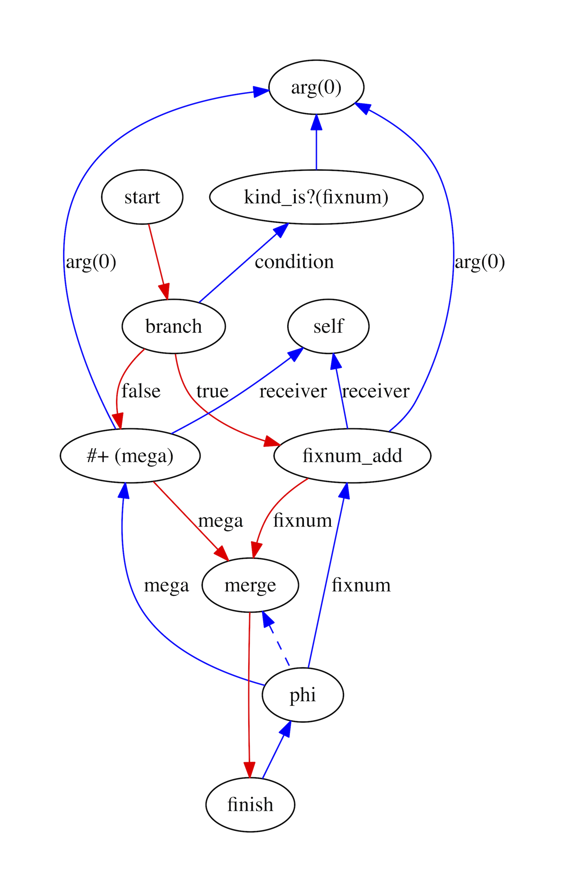
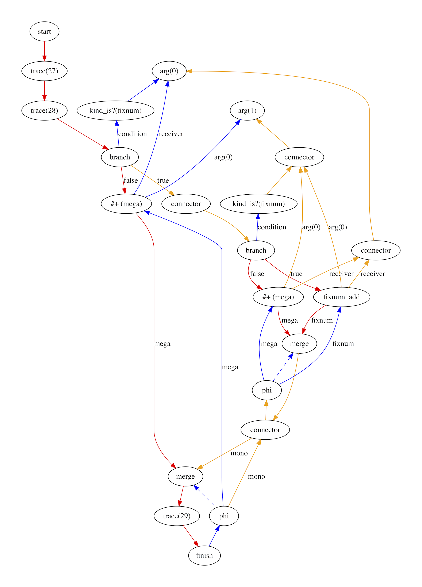
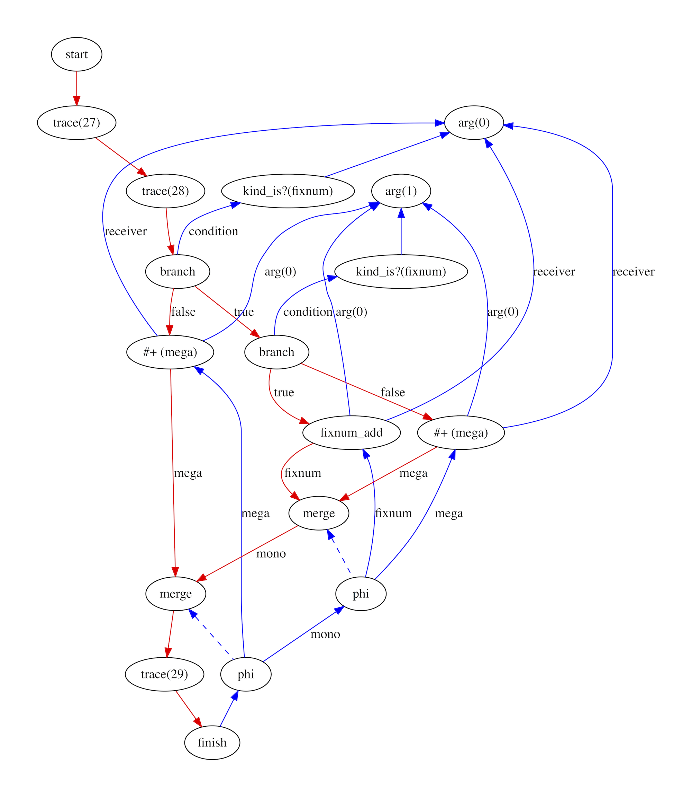
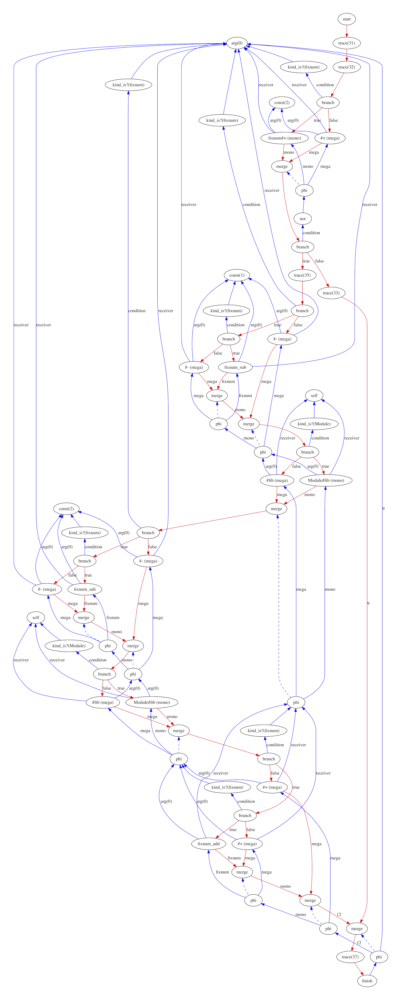

# RubyJIT

## Inlining

Inlining is often called the 'mother of all optimisations' because inlining
multiple methods into one allows the compiler to optimise them all at the same
time. It's particularly important in Ruby because almost all operations, even
basic arithmetic, is hidden inside core library methods which have to be inlined
to apply even basic optimisations.

The RubyJIT graphical IR makes inlining easy - we don't have to do much more
than replace the send node with the graph of the method we are inlining.

In order to be able to inline core library methods, which don't exist as Ruby
code, we also need implemenentations of these routines directly in IR.

### Why we need it

RubyJIT is a method-at-a-time JIT. This means that the compiler runs on just one
method at a time. This is as opposed to something like a tracing JIT, which runs
on a linear path of execution, no matter which method the code in that trace
comes from.

An advantage of a method-at-a-time JIT is that they are slightly better
understood and more conventional, and they are, in our opinion unsupported with
empirical evidence, possibly better suited to large applications rather than
benchmarks with a single big loop. A disadvantage of a method-at-a-time JIT is
that a method may not be a lot of code. A method in Ruby may contain almost
nothing but calls to other methods, when we remember that most Ruby operators
are also method calls. If the compiler only looks at a little code at a time, it
isn't going to be able to do very well. For idiomatic Ruby code that uses lot
of little arrays and hashes and divides things up into lots of small methods,
we want the compiler to be able to step back and take in as much of your code
at the same time as it can.

A particular need to inline in Ruby comes from the way that the core library
works. In Ruby, `a + b`, where `a` and `b` are both small integers (`Fixnums` in
Ruby 2.3, but the distinction is no longer visible to the programmer in Ruby
2.4), is really a method call `a.+(b)`. If we didn't inline this we would never
be able to optimise basic arithmetic because we would only see the send
operations.

### How it works

Before we can inline, we need to know exactly what method we are calling. For
this reason, we need to run the inline caching optimisation pass, to turn
general sends into sends that are for a particular kind of receiver.

#### Replacing a send with a graph

To inline a method, you replace the call to the method, with a copy of the body
of the code from the body of the method.

Usually, this involves quite a few engineering complexities. For example, you
may need to rename all the local variables so they don't conflict between the
two methods. You will need to replace a return instruction with a jump to the
point where the inlined method would have returned, and so on.

However because RubyJIT uses a sea-of-nodes graphical IR, inlining is fairly
straight forward. We don't have to do much more than take out the send node, and
replace it with the graph from the method that we are inlining. We then replace
`self` nodes in the inlined method with an edge to whatever the receiver edge
for the send was, and likewise with `arg` nodes. We don't have to rename
anything, because we have replaced names with edges.

One indirection is that we replace `self` and `arg` nodes with the same
`connector` nodes that we use when linking basic blocks in the graph
construction phase, and use the post build optimisation pass to tidy these up,
in order to avoid duplicating this code.

#### Inlining core library methods

For core library methods, there is no Ruby source code that we can build a graph
from to inline. Instead, we build IR directly for these methods. For a method
such as `fixnum#+(other)` (where `fixnum` is a kind for small integers that
isn't visible to the programmer in Ruby 2.4), the IR graph that we build looks
something like this:

```ruby
if other.is_a?(fixnum)
  fixnum_add(self, other)
else
  lookup_method(self, :+).call(other)
end
```

Notice that this looks a lot like the structure we built when we did inline
caching in a previous pass of the compiler. What we are doing here is deciding
what to do based on the right-hand-side of the `+`, rather than the
left-hand-side, as before. We already know the kind of the receiver, which was
the left-hand-side, and now we guard in the same way against the kind of the
sole argument, which is the right-hand-side.

If the right-hand-side is also a fixnum then we run a special primitive
operation `fixnum_add` that expects both arguments to be of kind `fixnum`. If
the right-hand-side isn't a `fixnum` then we run a conventional, megamorphic,
send that is able to handle any types.

The primitive operation `fixnum_add` is implemented not as another method, which
would itself need inlining, but instead it is implemented as a special node in
the IR.

#### Example

Consider again a simple method that adds together two numbers.

```ruby
def add(a, b)
  a + b
end
```

We'll say that this method has been run in the interpreter and profiled to
discover that `a` and `b` are only ever of kind `fixnum`. This is the IR graph
of the `add` method after the inline caching pass has run:



There are two sends - the monomorphic send that is run when the `a` is of kind
`fixnum` and megamorphic case that is run otherwise. We can inline the
monomorphic case, because since we know exactly what kind the receiver will be
at this point, we know exactly what method will called.

This is the IR graph for the method that we will inline, with the `fixnum_add`
primitive operation node, another fallback megamorphic send like in the calling
method, and a guard on the kind of the argument, to choose between the two:



To inline the second graph into the second, we just remove the original `send`
node and place this graph in its place. For simplicity, we use the same
`connection` nodes as we did when we are originally building graphs.



We then rely on the same post build pass that we run after constructing the
original graphs to remove these `connection` nodes and tidy up:



When we are finished the graph has become quite a lot more complicated. If we
look at a graph for a slightly more complicated (but still pretty trivial)
fibonacci function after inline-caching and inlining, there are now a great many
nodes, and many of the guards for the kinds of values are run multiple times. We
even guard against the kind of constants, which is tautological.



As with the inline caching pass, we are going to go back and remove this
complexity when we apply further optimisation passes such as deoptimisation,
later on.

We haven't talked here about what happens if the `fixnum_add` operation
overflows here. We'll solve that in a later document.

### More technical details

I don't know anything about the history of function inlining, but the phrase
'mother of all optimisations' is very common. In languages such as Ruby function
inlining is actually of no use without inline caching to create the monomorphic
sends that make inlining applicable.

The really hard part of inlining isn't applying it when you have decided to do
it, it's deciding when to do it in the first place, which isn't something we
have tackled in RubyJIT. We always inline core library methods, but we only
support a couple of them, and we don't consider inlining user methods at all.

When you start to inline more complex methods you have to think about how deep
to inline - when you inline a method should you then inline the methods that it
calls, and so on. It isn't the case that it's always a good idea to inline. Of
course, you can't simply keep inlining forever, and each time you do inline you
increase the size of the compiled code which consumes more space in your
processor's cache.

There doesn't seem to be a single algorithm that can decide perfectly whether or
not to inline, so we develop heuristics that judge if it's probably a good idea,
based on knowledge of how people are writing programs in practice. A classic
example of a heuristic that has caused surprising interactions is the JavaScript
just-in-time compiler V8, which [makes inlining decisions based on the number of
characters in the source code of a method](v8). This means that adding or removing
comments can make a difference to inlining and so the performance of an
application.

[v8]: http://jayconrod.com/posts/54/a-tour-of-v8-crankshaft-the-optimizing-compiler

Representing Ruby's core library methods as rich IR, rather than just operations
that are opaque to the compiler, has come to be understood to be a major part of
optimising Ruby.

Chris Seaton has talked about [how JRuby's performance is limited by a core
library implemented in Java](seaton) that is mostly not visible to the compiler.

[seaton]: https://www.youtube.com/watch?v=b1NTaVQPt1E

Evan Phoenix has talked about [the idea of shipping the LLVM compiler
IR](phoenix) of MRI's implementation of core library methods in C, in the MRI
binary so that a theoretical MRI JIT could inline them.

[phoenix]: https://www.youtube.com/watch?v=QaLvtNpoc5o

The Rubinius implementation of Ruby does actually implement `fixnum#+` in Ruby,
in a similar pattern to how we've described, although the logic is slightly
obscured. The `fixnum_add` primitive tries to do a native machine add. If that
doesn't work the next expression executes which is the fallback megamorphic
case.

```ruby
def +(o)
  Rubinius.primitive :fixnum_add
  redo_coerced :+, o
end
```

### Potential projects

* Implement inlining of user methods.
* Implement a heuristic to decide whether it is worth inlining or not, perhaps
  by extending the functionality of the profiler.
