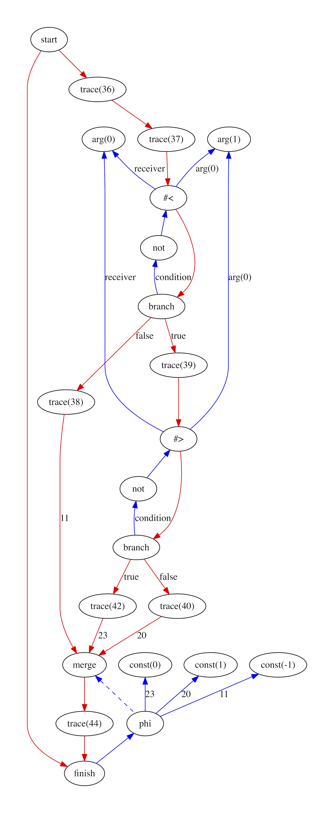
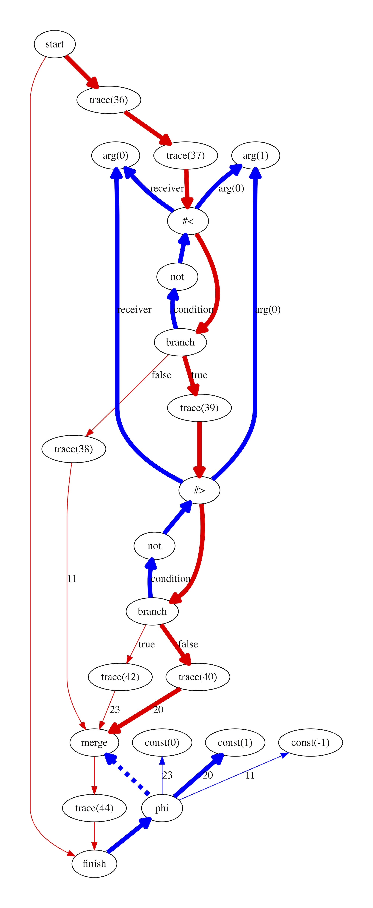
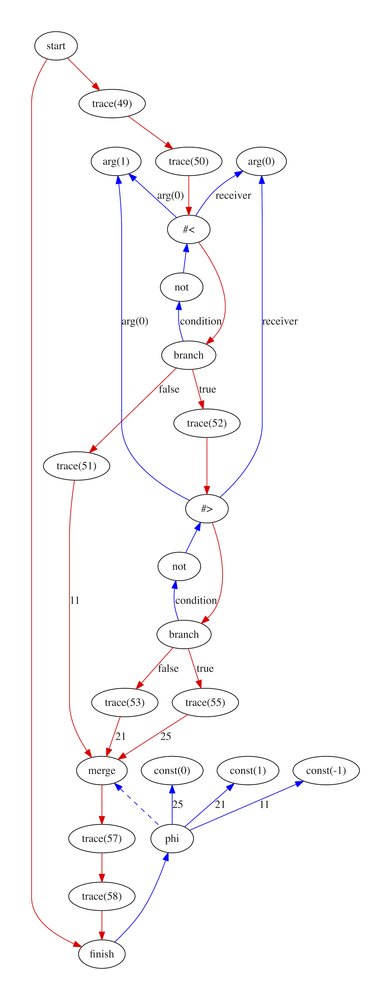

# RubyJIT

## Intermediate representation

The RubyJIT intermediate representation is the data structure that we use to
represent a Ruby program as we compile and optimise it.

Our intermediate representation is not a research innovation, but it may be
different to the intermediate representations that you have seen in compiler
text books or undergraduate courses in compilers. We use a graph to represent
Ruby programs, so we say that we have a 'graphical' IR. We use the variant often
called 'sea-of-nodes', or 'soup-of-nodes', which emphasises a fluid structure
and makes some optimisations more natural.

### Why we need it

The intermediate representation is the heart of our compiler. After we have
parsed the bytecode from the various implementations of Ruby into our own
bytecode format, we then convert again into our intermediate representation, and
from there all stages and passes of the compiler work on the intermediate
representation until machine code bytes are emitted.

The graph intermediate representation allows us to take some things that are
usually implicit in a Ruby program, such as the constraints on the order that
expressions have to be executed, and make them explicit. We can then manipulate
the program based on these constraints and optimise it, keeping the program true
to its original intent.

We can implement optimisations by replacing nodes or groups of nodes in the
graph with other nodes that do the same thing more efficiently. As we move to
emitting machine code at the end of compilation, we can replace nodes that
directly represent Ruby operations with nodes that do the same thing as real
machine instructions. Emitting the machine code is then just emitting the nodes
form the graph in order.

### How it works

#### What a graph is

Most programming languages don't have a 'graph' data structure built-in in the
same way that most have have an array or list and a hash or a map, so some
people may not be aware of what we really mean by a graph.

A graph is a collection of objects called 'nodes' (sometimes called 'vertices').
What your nodes represent is up to you. The equivalent of instance variables on
nodes are often called the 'labels'. Two nodes can be linked by an 'edge'
(sometimes called an 'arc'). What your edges represent is up to you. Instance
variables on edges are also often called the 'labels'. Edges can have a
direction, which means each edge has a node it is going form and a node it is
going to.

I've seen graphs mostly discussed in popular writing in terms of the Git version
control system. Git's graphs are directed (the edges have a direction) and
acyclic (you can't reach a node again by following edges). Compiler graphs like
in our intermediate representation are usually directed, but cyclic, due to
programs having loops in them.

#### Nodes

In our intermediate representation a node represents either the source of a
value, such as a method argument, or a computation which takes values as input
and produces a value as a result. As we will see, what we mean by 'value' can
become quite abstract.

As the program is compiled, groups of nodes are generally replaced with more
efficient groups of nodes. Towards the end of compilation, higher level nodes
representing Ruby operations are replaced with nodes that correspond directly to
machine code instructions.

#### Edges

In our intermediate representation an edge represents a value being sent from
one node to another. A node that represents an add operation has edges coming
from two input nodes to take their values, and has an edge going to at least one
other node that needs the result of the addition.

Many edges often represent values - Ruby objects. Edges can also represent more
abstract concepts. The expressions in your Ruby program have to be executed in a
certain order to run correctly. For example a file must be opened before it can
be written to. In our intermediate representation we enforce this by having a
special value that is called 'control'. We add an edge from the file open to the
file write called 'control' to say that the open must happen first.

In some other graphical IRs these special values are thought of as representing
the state of the system's RAM, or even the entire world, as an immutable value
being passed through the entire program as a value. Each node that modifies
global memory or does some kind of IO is thought of as taking the world as input
and producing a new world as output. This is similar to how some functional
programming languages think of IO and other forms of mutable state.

#### The graph

All our nodes and edges together form a graph. Our graphs alway start at a
'start' node and finish at a 'finish' node. Even if your Ruby method has
multiple return points, in our graphs they always lead to the same finish node
for simplicity.

When you look at a whole graph, you can think of executing it by tracing the
line of the control value from the start node to the finish node, executing each
node you reach, and then returning the value that goes into the finish node. To
find that value you may have to execute other nodes to get their values, and so
on.

Consider this example of a Ruby method for adding two numbers and returning the
result:

```ruby
def add(a, b)
  a + b
end
```

The graph of this add method looks like this:


We have the start and finish nodes, and then every other node represents some
computation in that method (ignore the 'merge' node - we'll explain that
later). The trace nodes say that execution has reached a certain line in the
Ruby program, and are used for implementing `set_trace_func`. The 'arg' nodes
are short for 'argument' and mean the arguments that come into the method. The `#+`
node calls the method `+`.

There are two colors of edges in this graph - red and blue. All the red edges
point downward and the blue edges point upward. Red edges represent control
values, and blue edges represent all other values. Some edges are labelled. For
example the blue edges into the `#+` node are labelled as the receiver and the
arguments. We only label edges if they would be unclear otherwise.

Each red edge means that the node at the start of the arrow must be executed
before the node at the end of the arrow, so that forms our order of execution
for nodes which must happen in a particular order. Each blue edge means that to
find the value of a node, we must first find the value of the nodes indirected
by the blue edges coming out of the node.

However, it doesn't matter in what order we follow the blue edges or execute the
nodes on them unless they have red edges, because their values don't change by
the order in which they are executed. For example, we can get the value of the
method arguments at any time and their values will be the same (ignore for the
moment the fact that arguments in Ruby are just local variables which can be
modified - this isn't what we mean). As we will show later, this allows us to
optimise your program.

#### Branches and merges

What we've described so far only works for programs that run a linear sequence
of instructions without any `if` statements.

Consider this example of a Ruby method that takes two numbers and returns `-1`
if the first is less than the second, `+1` if the first is greater, or `0`
otherwise (if they're equal).

```ruby
def compare(a, b)
  if a < b
    -1
  elsif a > b
    +1
  else
    0
  end
end
```

The graph of this compare method looks like this:



Now the sequence of red arrows is not linear. There are two points where it
branches - branch nodes. It merges again - twice - into merge nodes and then to
the finish node. This is how we represent `if` statements - by branching the
control flow into one direction for the truthy case and another direction for
the falsey case. Code that is run no matter which branch we took (ignoring
things like exceptions for now), such as code after the end of an `if`
statement, comes after the two branches are merged.

In our IR, it is the finish node alone that can return a value. It's as if in
your Ruby code there is allowed to be a single `return` expression at the end of
the method. In this method this means that the return value for the finish node
could come from any of the three cases. If we connected all those values as
edges into the finish node, how would it know which to pick?

This is done with a 'phi' node. It isn't very important where the name comes
from, but we'll explain this later. A phi node selects one of several inputs.
The switch for which one to use is an edge going to a merge node. Whichever edge
came into the merge, we chose the corresponding edge coming into the phi node.
The edges are numbered with the blocks' original instruction offsets so you can
see which matches up with which.

To make this more clear we've traced in bold the edges which are used in the
case of `a` being greater than `b`:



When control reaches the merge node we then get the value from the phi node. The
program 'remembers' the direction from which control came into the merge node
and passes this as a value to the phi node which uses that as a switch to chose
the correct value. In practice this is not how this is implemented, but it is
the logical model.

### Local variables

Note that the graphs don't contain and reads or writes from any names, such as
local variables. Instead, the edges in our graph replace the names. In a more
conventional intermediate representation an add instruction might have three
variables - two values and a result - or one of the values may also be the
result. In our graph, the add instruction instead has two input edges and an
output edge.

Even local variables become edges in our graph. If we modify our compare routine
from above to use a local variable like this:

```ruby
def compare(a, b)
  if a < b
    n = -1
  elsif a > b
    n = +1
  else
    n = 0
  end
  n
end
```

We may expect to see references to the name `n` somewhere in the graph, but
instead we have almost exactly the same graph as before in the version with
no name. In the previous graph we turned the implicit data flow to the method
return into edges, and in this graph we turned the explicit local variable
name into edges in the same way.



Note that we've run a couple of optimisation phases, which are explained later
in another document, to tidy up the graphs shown above after they have been
constructed.

### More technical details

Graphical intermediate representations are not a new development, but they don't
seem to be applied much in practice. GCC and LLVM, two of the most popular
compilers, both more traditional linear intermediate representations. The V8
JavaScript interpreter's very top tier, Turbofan, uses a graphical IR but
otherwise V8 doesn't. The server compiler (also called 'C2', the one you get
with the `-server` flag) in the HotSpot JVM uses a graphical intermediate
representation, as does the Graal JVM compiler.

It is the C2 compiler's IR on which RubyJIT's is based in terms of structure,
but not implementation details. C2's IR is described in papers [1](sea) and
[2](c2) by the original designer, Cliff Click, and others.

[sea]: http://grothoff.org/christian/teaching/2007/3353/papers/click95simple.pdf
[c2]: https://www.usenix.org/legacy/events/jvm01/full_papers/paleczny/paleczny.pdf

Graphical IR's like RubyJIT's are a form of 'program dependence graph'. I'm not
sure of the history but I think originally the graphical part was done simply
within basic blocks and nodes did not usually flow between basics. I believe
that the [`libFirm`](firm) library for writing compilers is a graphical IR but
with this restriction that each basic block is its own little graph.

[firm]: http://pp.ipd.kit.edu/firm/

It's possible that graphical IRs use more memory and cause more indirect memory
accesses which defeat your processor's caches, which is one reason why they may
not be more popular. The implementation of our IR is certainly not compact. Each
node has an object allocated for it, and reaching from one node to another means
at least two memory indirections. The paper above on C2 spends a lot of time
talking about how they made their representation use less memory.

It may also be the case that graphical IRs are harder to visualise and
understand which makes working with them more difficult. You probably do need
some kind of graphical tool to understand non-trivial graphs, rather than
relying on pretty-printed text. The RubyJIT graph visualiser does this for us.

### Potential projects

* Use ideas from Cliff Click to reduce the memory consumption and indirection
  of our implementation of the IR.
